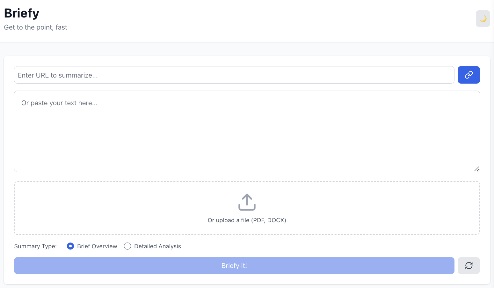
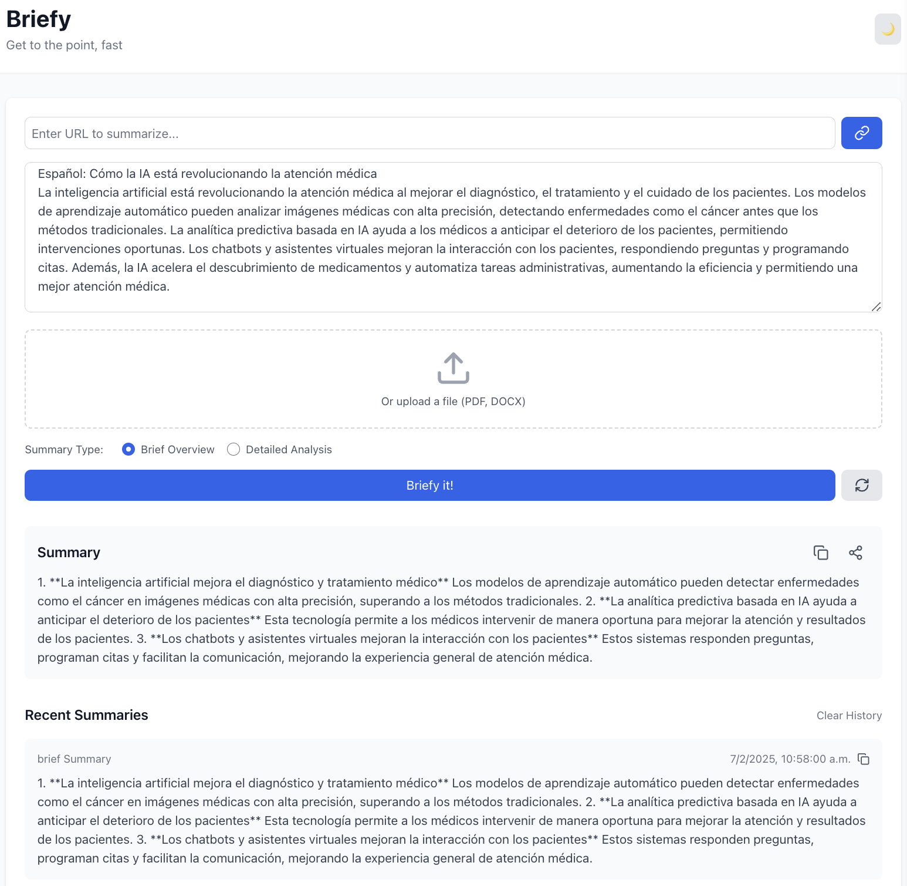
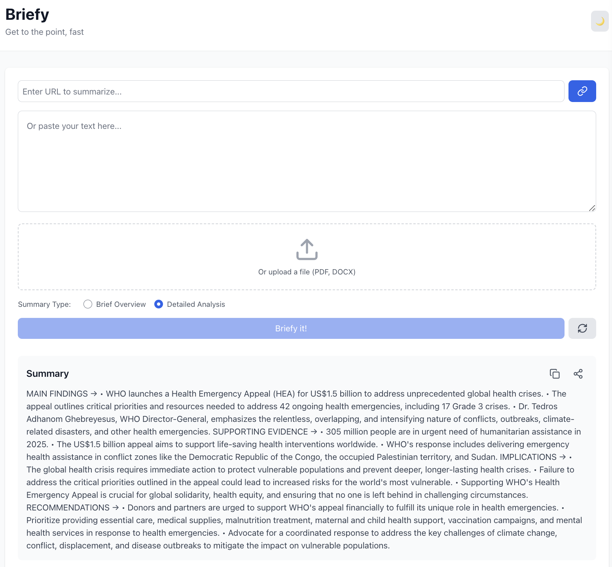

# Briefy 🚀

[](https://www.python.org/downloads/) [](https://reactjs.org/) [](https://openai.com/) [](https://fastapi.tiangolo.com/) [](https://tailwindcss.com/)

Briefy is an intelligent text summarization tool that helps you get to the point, fast. It processes text from multiple sources and generates concise, meaningful summaries using OpenAI's powerful language models.

## 🎯 Features

- **Multi-Source Input**: Accept text via direct input, URL, PDF, or DOCX files
- **Flexible Summarization**: Choose between brief overview or detailed analysis
- **Language Support**: Maintains original language in summaries
- **History Tracking**: Keep track of recent summaries
- **Dark Mode**: Toggle between light and dark themes
- **Copy & Share**: Easy-to-use copy and share functionality

## 📸 Screenshots
<div align="center">
  
  <br><br>
  
  <br><br>
  
  <br><br>
  
</div>

## 🛠️ Tech Stack

- Frontend: React, TailwindCSS
- Backend: Python, FastAPI
- AI: OpenAI GPT API
- Document Processing: PyPDF2, python-docx

## 📁 Project Structure
```
briefy/
├── frontend/          # React application
├── backend/           # FastAPI server
├── samples/           # Sample documents & screenshots
│   ├── documents/     # Sample PDFs and DOCXs
│   └── images/        # UI screenshots
└── README.md
```
## 🚀 Installation

1. Clone the repository:
  git clone https://github.com/yourusername/briefy.git
  cd briefy

2. Setup Backend:
  cd backend
  python -m venv venv
  source venv/bin/activate  # Windows: venv\Scripts\activate
  pip install -r requirements.txt

3. Setup Frontend:
  cd frontend
  npm install

4. Environment Setup:
  Create .env file in backend directory with:
  OPENAI_API_KEY=your_api_key_here

## 🎮 Usage

1. Start Backend Server:
  cd backend
  python main.py

2. Start Frontend:
  cd frontend
  npm start

3. Access the application at http://localhost:3000

## 💡 Features in Detail

- **Text Input**: Paste text directly or upload documents
- **URL Processing**: Enter web article URLs for automatic summarization
- **File Support**: Upload PDF and DOCX files
- **Summary Options**: Choose between brief or detailed summaries
- **History**: View and manage previous summaries
- **Copy/Share**: Easy sharing of generated summaries
- **Language Support**: Maintains original language in summaries (primarily tested with English, Spanish, and French texts; other languages may vary)

## 🧰 API Endpoints

- POST /api/summarize - Process direct text or URLs
- POST /api/summarize/file - Process uploaded files

## 🎨 UI Features

- Responsive design
- Dark mode support
- Clear error handling
- Loading states
- Copy to clipboard
- Summary history

## 📝 Notes

- **Language Handling**: The app is designed to maintain the original language of the input text in summaries. This has been thoroughly tested with English, Spanish, and French texts. While other languages may work, results may vary in maintaining the original language.

## 📜 License

MIT License

## 🤝 Contributing

Contributions, issues, and feature requests are welcome!

## 📬 Contact

- Don Deerie B. Dumayas - [LinkedIn: http://linkedin.com/in/ddumayas34959b28]
- Project Link: https://github.com/dondeerie/briefy